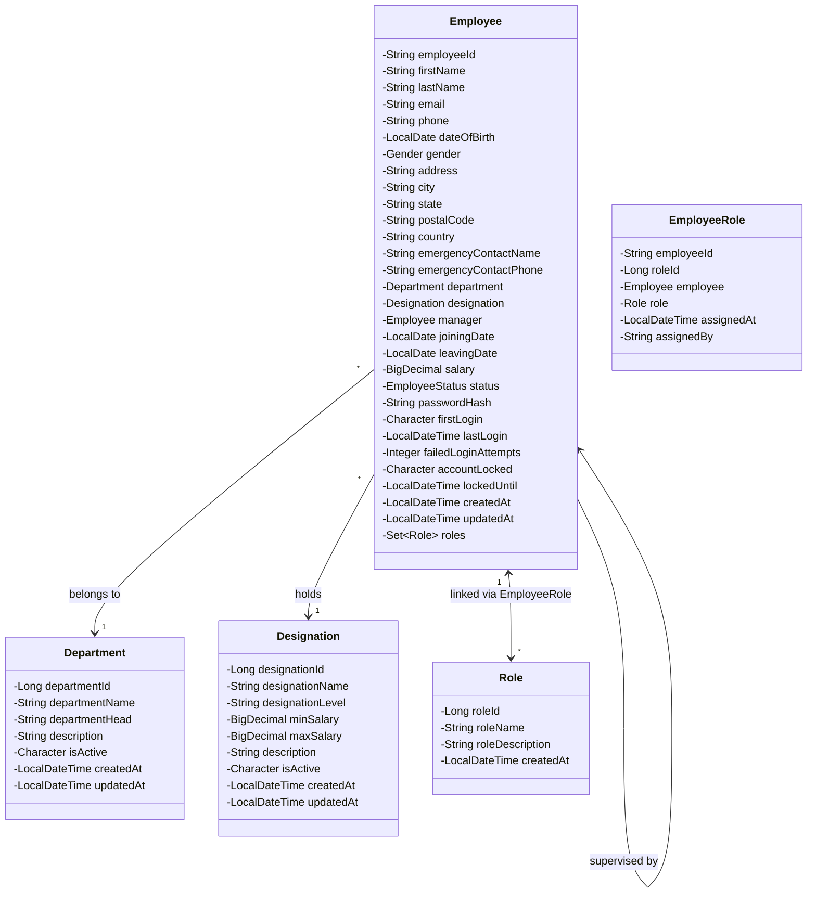
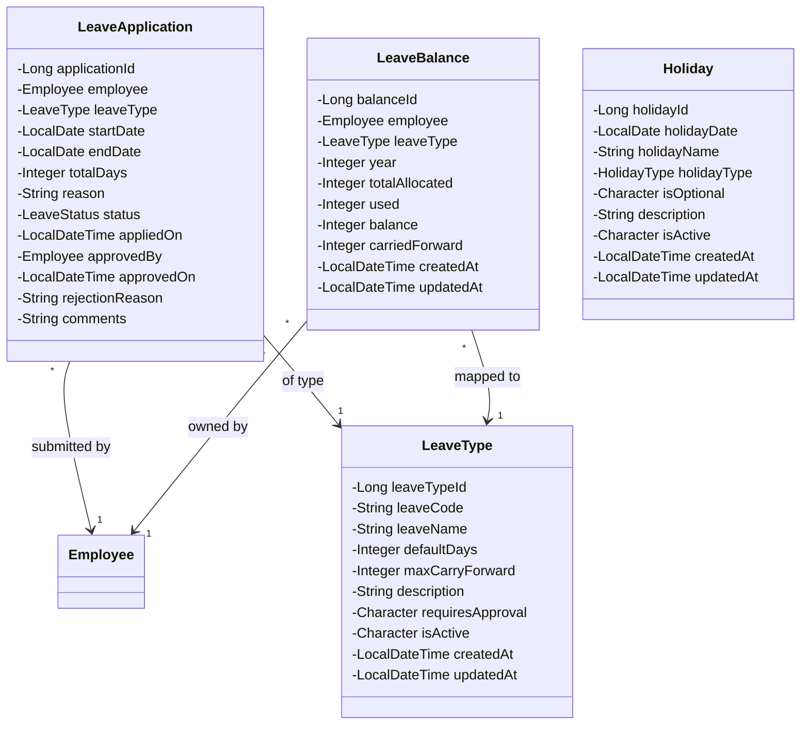
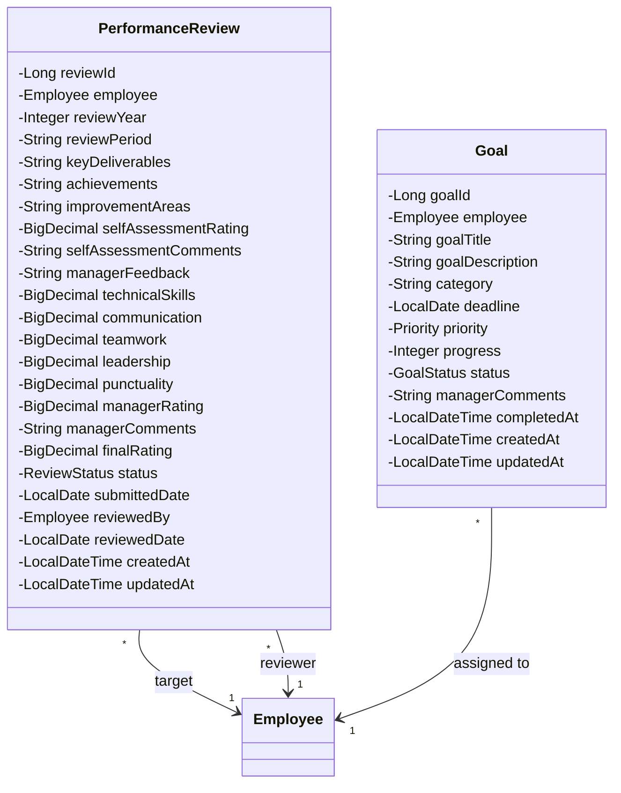
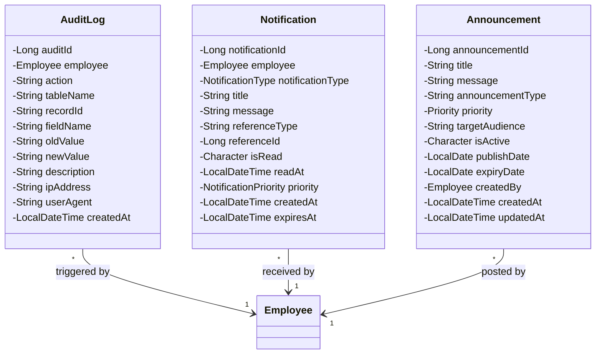
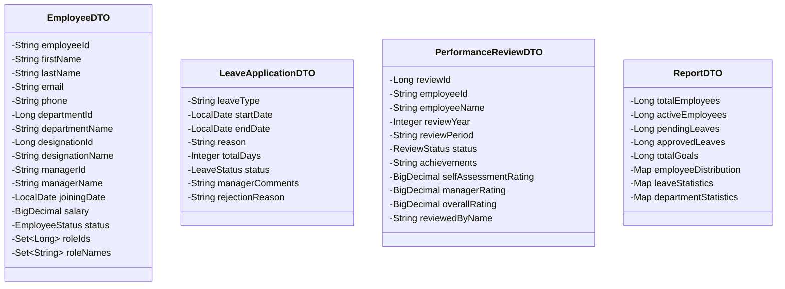

# Detailed Class Diagrams

This document contains comprehensive Class Diagrams mapping all properties for Entities and Data Transfer Objects (DTOs) within the RevWorkForce platform.

## 1. Core HR Domain Models

## 2. Leave and Holiday Management

## 3. Performance & Goals System

## 4. System Logs, Notifications and Announcements

## 5. Primary DTOs (Data Transfer Objects)

