# Detailed Control Flows (Interaction Logic)

This document visualizes the complex internal logic gates, conditionals, and interaction sequences executing specifically within the `ServiceImpl` architecture layers. Unlike Sequence diagrams mapping controller-to-repository handshakes, these flowcharts track data mutation states.

## 1. Leave Logic Parsing Algorithm (Apply Leave)

When an Employee attempts to submit a Leave, the system calculates duration and overlaps natively before invoking persistence.

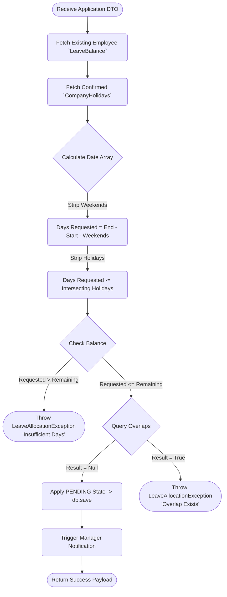

## 2. Leave Adjudication Logic (Manager Action)

Tracking the data mutations that occur once a manager clicks "Approve".

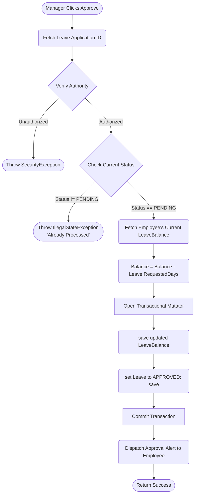

## 3. The Performance Review State Machine

Performance Reviews are finite-state-machines. A record traverses a rigid mapping of statuses which controls accessibility at the Controller layer.

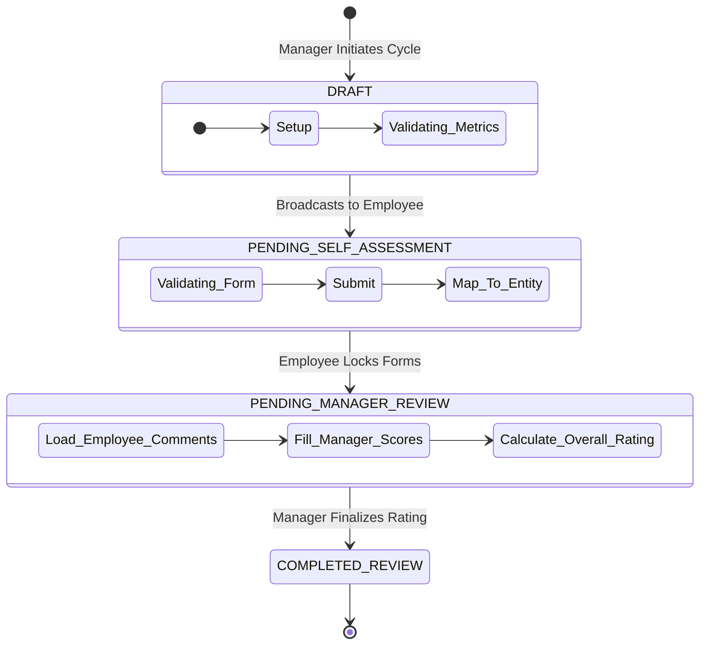

## 4. Goal Completion Background Automation

When an employee invokes `updateProgress()`, the system asserts the updated numbers to automatically seal records escaping manual oversight.

```mermaid
flowchart TD
    Start([Receive Update Request]) --> Valid{Validate Number Range}
    Valid -- (n < 0 OR n > 100) --> Err([Throw ValidationException])
    Valid -- (0 <= n <= 100) --> Load(Fetch Goal Entity)
    
    Load --> Condition{Evaluate Completion Threshold}
    
    Condition -- (n < 100) --> Save1(Assign n% to Goal)
    Save1 --> Ret1([Return Process])
    
    Condition -- (n == 100) --> Trig(Trigger Automation)
    Trig --> State(Assign GoalStatus.COMPLETED)
    State --> Time(Assign completedDate = now())
## 5. Authentication & Login Control Flow

This sequence models the gating checkpoints protecting the application from brute force and unauthorized entry.

```mermaid
flowchart TD
    Start([User Submits Credentials]) --> Fetch(Search `Employee` by Email/ID)
    Fetch --> Exists{Record Exists?}
    
    Exists -- No --> Err1([Throw BadCredentialsException])
    Exists -- Yes --> Lock{Is Account Locked?}
    
    Lock -- Yes --> CheckTime{Lockout Expired?}
    CheckTime -- No --> Err2([Throw LockedException])
    CheckTime -- Yes --> Unlock(Set Locked = False, Reset Attempts)
    
    Unlock --> Match{Check Password Hash}
    Lock -- No --> Match
    
    Match -- Invalid --> IncCount(Increment Failed Attempts)
    IncCount --> Thresh{Attempts >= 5?}
    Thresh -- Yes --> LockAcc(Set Locked = True, Log Audit)
    Thresh -- No --> SaveInc(Save Employee) --> Err1
    LockAcc --> Err1
    
    Match -- Valid --> FW{Is First Login?}
    FW -- Yes --> RedirectUpdate([Force Redirect to Change Password])
    FW -- No --> ResetCount(Reset Failed Attempts to 0)
    
    ResetCount --> SetLastTime(Update lastLogin Timestamp)
    SetLastTime --> End([Generate JWT / Establish Session])
```

## 6. Password Recovery Control Flow

Flow mapping a user asserting identity via secondary markers (Security Questions) to restore standard access.

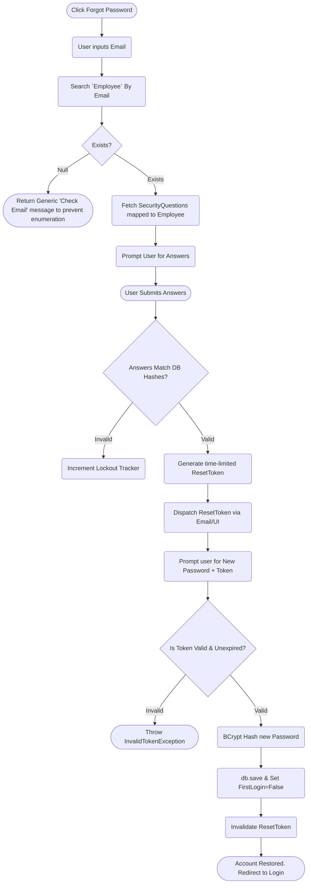

## 7. Audit Logging System Flow

Invisible background flow: Every `save`, `update`, and `delete` within critical `ServiceImpl` modules intercepts here asynchronously.

```mermaid
flowchart LR
    Origin([Service Layer Mutation e.g. 'deleteGoal']) --> Intercept(Execute Aspect @AfterReturning)
    
    Intercept --> Build(Construct `AuditLog` Object)
    Build --> MapA(Map Action E.g., 'DELETE')
    MapA --> MapB(Map Target Table/Entity ID)
    MapB --> MapC(Map SecurityContext Principal ID string)
    MapC --> MapD(Map IP Address/User Agent string from RequestContext)
    
    MapD --> Thread(Spawn Async Background Thread)
    Thread --> Insert([db.save AuditLog. Returns Context])
```

## 8. Employee Onboarding Flow (Admin Action)

Visualizes how the system builds out a new employee tree when the Administrator initializes one.

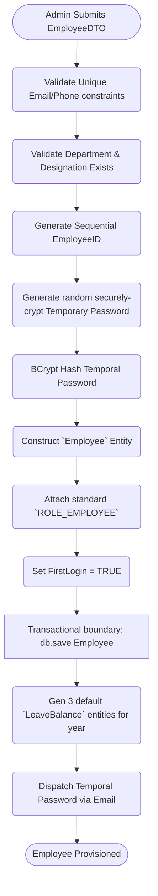

## 9. Manager: Revoke Approved Leave Flow

Tracking exceptional circumstances where an already approved timeline must be forcefully disrupted by Leadership.

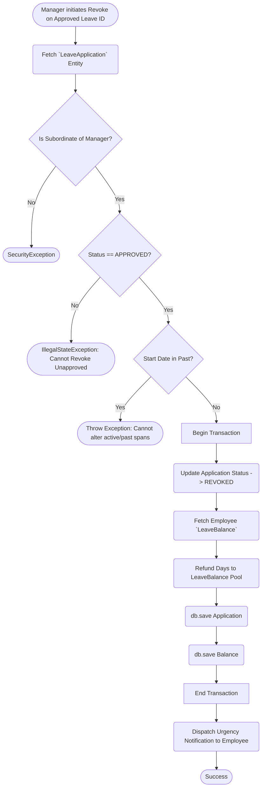

## 10. Administrator: Global Profile/Configuration Update Flow

System-level updates (Data synchronization, Holiday manipulation) execute cautiously differently from user-space logic.

```mermaid
flowchart TD
    Start([Admin Modifies Global Profile e.g. Adds Holiday]) --> Validate(Check Date Doesn't Exist)
    Validate --> Exec[Begin Transaction]
    Exec --> Insert(Insert new `Holiday` Entity)
    Insert --> Commit[End Transaction]
    
    Commit --> TriggerAsync(Spawn Asynchronous Recalculator)
    TriggerAsync --> QueryLev(Search all PENDING `LeaveApplications` encompassing date)
    
    QueryLev --> LoopLev{Process List}
    LoopLev --> |Loop Applications| Recalc(Detect if requested duration changes)
    Recalc --> Math(Math: Duration -= 1 if Match Holiday)
    Math --> SaveL(db.save updated PENDING duration)
    SaveL --> Next(Loop)
    
## 11. Profile Update Flow

Mapping how non-critical employee profile information is sanitized and attached, avoiding modifications to restricted properties like roles or locked states.

```mermaid
flowchart TD
    Start([User Submits Profile Update DTO]) --> Map(Extract Updatable Fields: Address, Phone, Contacts)
    Map --> Fetch(Fetch Current `Employee` State by ID)
    
    Fetch --> Attach(Update object properties in-memory)
    Attach --> Validate{Standard Constraint Validations Passed?}
    
    Validate -- No --> Err([Throw ValidationException])
    Validate -- Yes --> Exec[Begin Transaction]
    
    Exec --> Save(db.save Employee)
    Save --> Commit[End Transaction]
    
    Commit --> Alert(Dispatch 'Profile Updated' standard notification)
    Alert --> End([Return Success & Fresh Profile Payload])
```

## 12. Admin: Leave Quota Assignment/Generation Flow

At the beginning of a fiscal reporting year, Admins trigger logic to generate new blank arrays of `LeaveBalance` properties for all active employees.

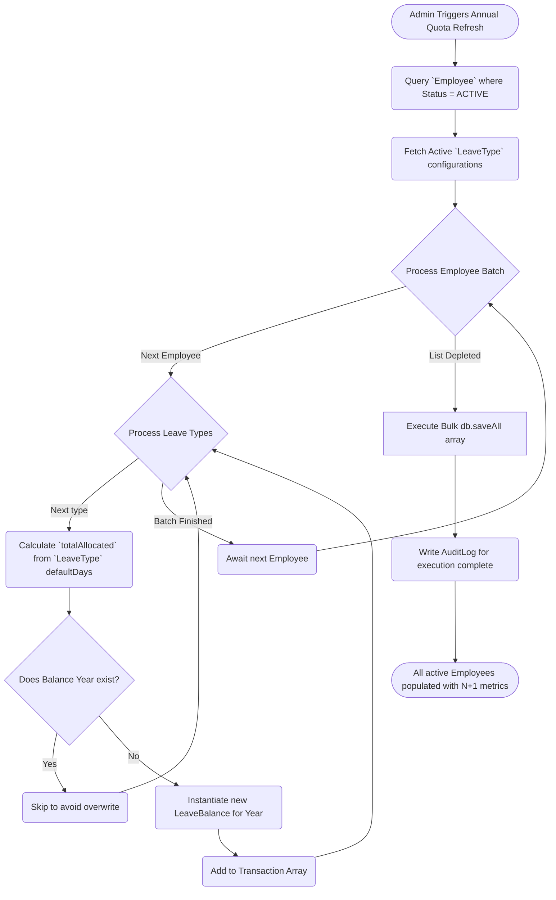

## 13. Goal Performance Assessment Pipeline

Tracking how iterative `progress` updates trigger calculations against the eventual overall evaluation weight map.

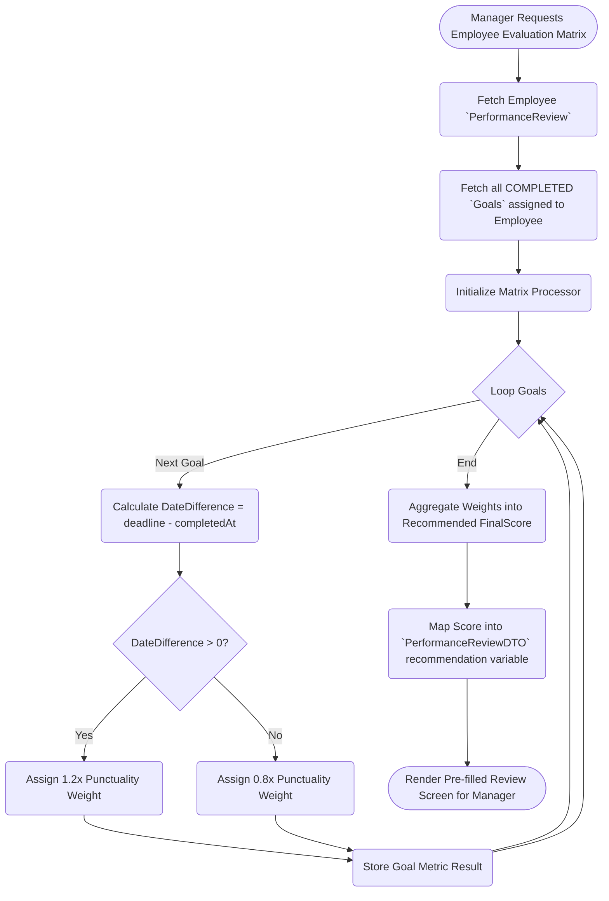

## 14. Global Notification Broadcasting Flow

Charting how the Admin or System Broadcast components effectively loop and spam asynchronous alert events down the tree without blocking primary HTTP request threads.

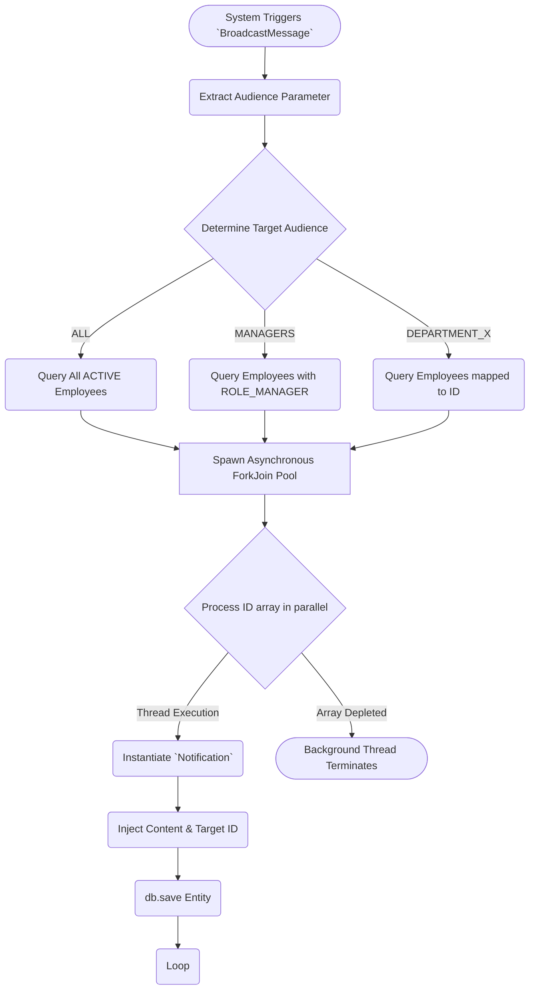

## 15. Reports Extraction (Export to Presentation Layer)

Tracking the huge computational funnel gathering system states for mapping to DataVisualization components (e.g. pie charts).

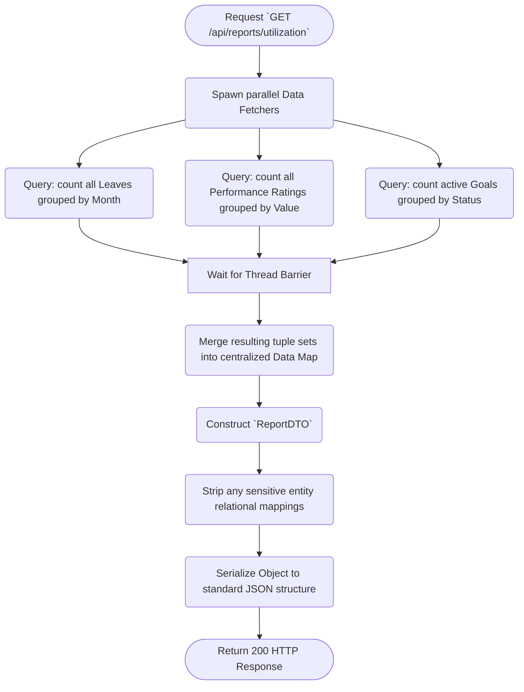
