# Detailed Service Sequence Diagrams (Interaction Logic)

This document visualizes the complex internal logic gates, conditionals, and interaction sequences executing specifically within the `ServiceImpl` architecture layers. It maps the data mutation states previously detailed in flowcharts into precise sequence diagrams.

## 1. Leave Logic Parsing Algorithm (Apply Leave)

When an Employee attempts to submit a Leave, the system calculates duration and overlaps natively before invoking persistence.

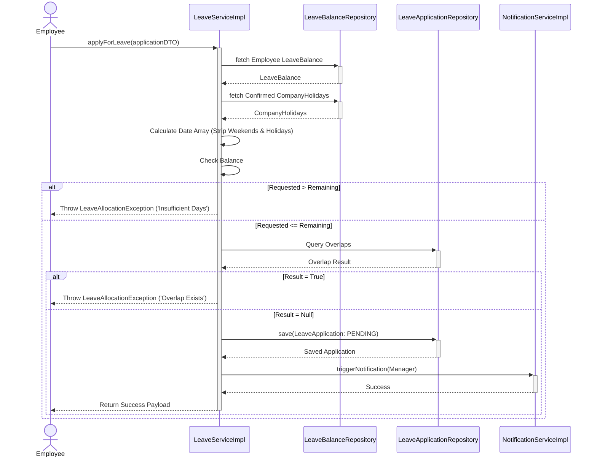
```mermaid
sequenceDiagram
    actor Employee
    participant LeaveService as LeaveServiceImpl
    participant LeaveDAO as LeaveBalanceRepository
    participant AppDAO as LeaveApplicationRepository
    participant NotificationService as NotificationServiceImpl
    
    Employee->>+LeaveService: applyForLeave(applicationDTO)
    LeaveService->>+LeaveDAO: fetch Employee LeaveBalance
    LeaveDAO-->>-LeaveService: LeaveBalance
    LeaveService->>+LeaveDAO: fetch Confirmed CompanyHolidays
    LeaveDAO-->>-LeaveService: CompanyHolidays
    
    LeaveService->>LeaveService: Calculate Date Array (Strip Weekends & Holidays)
    LeaveService->>LeaveService: Check Balance
    
    alt Requested > Remaining
        LeaveService-->>Employee: Throw LeaveAllocationException ('Insufficient Days')
    else Requested <= Remaining
        LeaveService->>+AppDAO: Query Overlaps
        AppDAO-->>-LeaveService: Overlap Result
        alt Result = True
            LeaveService-->>Employee: Throw LeaveAllocationException ('Overlap Exists')
        else Result = Null
            LeaveService->>+AppDAO: save(LeaveApplication: PENDING)
            AppDAO-->>-LeaveService: Saved Application
            LeaveService->>+NotificationService: triggerNotification(Manager)
            NotificationService-->>-LeaveService: Success
            LeaveService-->>-Employee: Return Success Payload
        end
    end
```

## 2. Leave Adjudication Logic (Manager Action)

Tracking the data mutations that occur once a manager clicks "Approve".

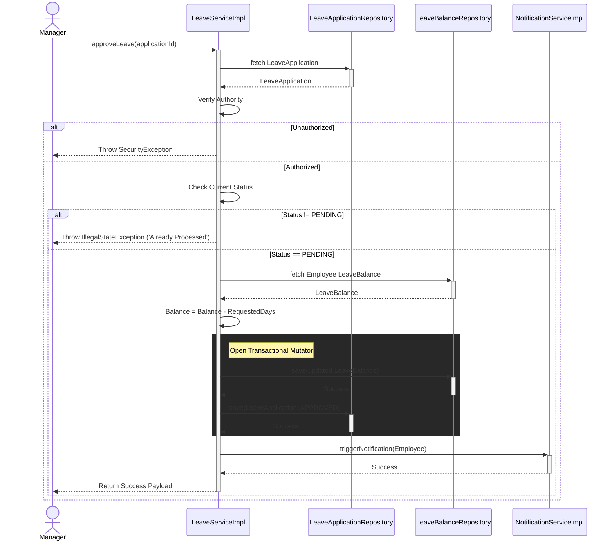
```mermaid
sequenceDiagram
    actor Manager
    participant LeaveService as LeaveServiceImpl
    participant AppDAO as LeaveApplicationRepository
    participant LeaveDAO as LeaveBalanceRepository
    participant NotificationService as NotificationServiceImpl
    
    Manager->>+LeaveService: approveLeave(applicationId)
    LeaveService->>+AppDAO: fetch LeaveApplication
    AppDAO-->>-LeaveService: LeaveApplication
    
    LeaveService->>LeaveService: Verify Authority
    alt Unauthorized
        LeaveService-->>Manager: Throw SecurityException
    else Authorized
        LeaveService->>LeaveService: Check Current Status
        alt Status != PENDING
            LeaveService-->>Manager: Throw IllegalStateException ('Already Processed')
        else Status == PENDING
            LeaveService->>+LeaveDAO: fetch Employee LeaveBalance
            LeaveDAO-->>-LeaveService: LeaveBalance
            
            LeaveService->>LeaveService: Balance = Balance - RequestedDays
            
            rect rgb(40, 40, 40)
            note right of LeaveService: Open Transactional Mutator
            LeaveService->>+LeaveDAO: save(updated LeaveBalance)
            LeaveDAO-->>-LeaveService: Success
            LeaveService->>+AppDAO: save(LeaveApplication: APPROVED)
            AppDAO-->>-LeaveService: Success
            end
            
            LeaveService->>+NotificationService: triggerNotification(Employee)
            NotificationService-->>-LeaveService: Success
            LeaveService-->>-Manager: Return Success Payload
        end
    end
```

## 3. The Performance Review State Machine

Performance Reviews traverse a rigid mapping of statuses which controls accessibility at the Controller layer.

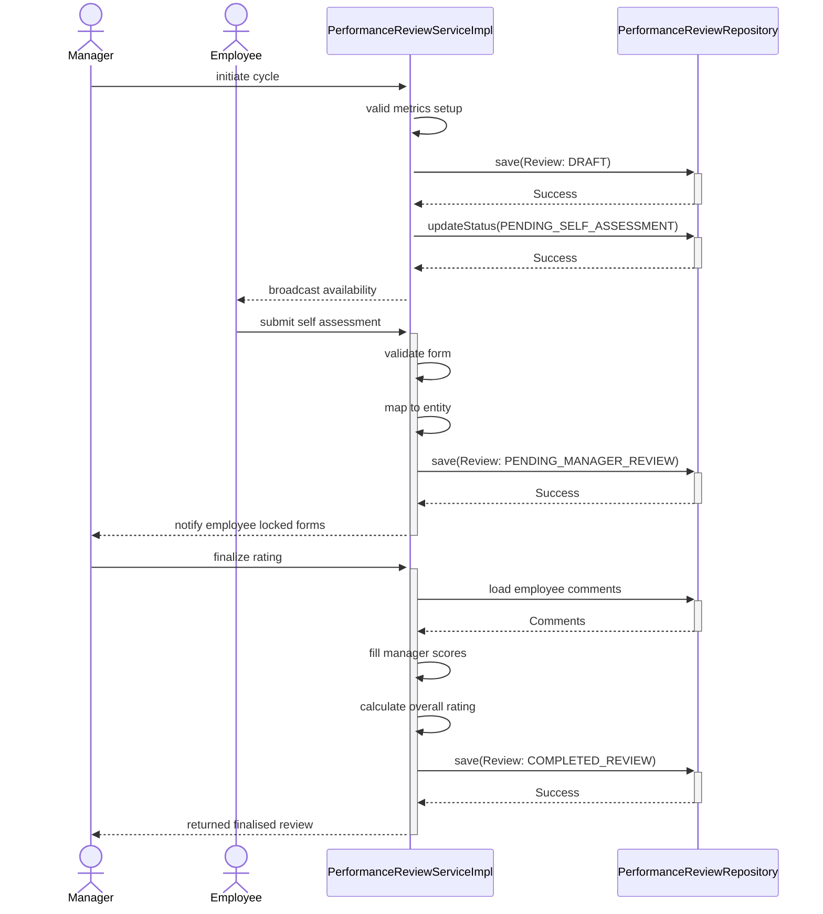
```mermaid
sequenceDiagram
    actor Manager
    actor Employee
    participant ReviewService as PerformanceReviewServiceImpl
    participant ReviewDAO as PerformanceReviewRepository
    
    Manager->>+ReviewService: initiate cycle
    ReviewService->>ReviewService: valid metrics setup
    ReviewService->>+ReviewDAO: save(Review: DRAFT)
    ReviewDAO-->>-ReviewService: Success
    
    ReviewService->>+ReviewDAO: updateStatus(PENDING_SELF_ASSESSMENT)
    ReviewDAO-->>-ReviewService: Success
    ReviewService-->>Employee: broadcast availability
    
    Employee->>+ReviewService: submit self assessment
    ReviewService->>ReviewService: validate form
    ReviewService->>ReviewService: map to entity
    ReviewService->>+ReviewDAO: save(Review: PENDING_MANAGER_REVIEW)
    ReviewDAO-->>-ReviewService: Success
    ReviewService-->>-Manager: notify employee locked forms
    
    Manager->>+ReviewService: finalize rating
    ReviewService->>+ReviewDAO: load employee comments
    ReviewDAO-->>-ReviewService: Comments
    ReviewService->>ReviewService: fill manager scores
    ReviewService->>ReviewService: calculate overall rating
    ReviewService->>+ReviewDAO: save(Review: COMPLETED_REVIEW)
    ReviewDAO-->>-ReviewService: Success
    ReviewService-->>-Manager: returned finalised review
```

## 4. Goal Completion Background Automation

When an employee invokes `updateProgress()`, the system asserts the updated numbers to automatically seal records escaping manual oversight.

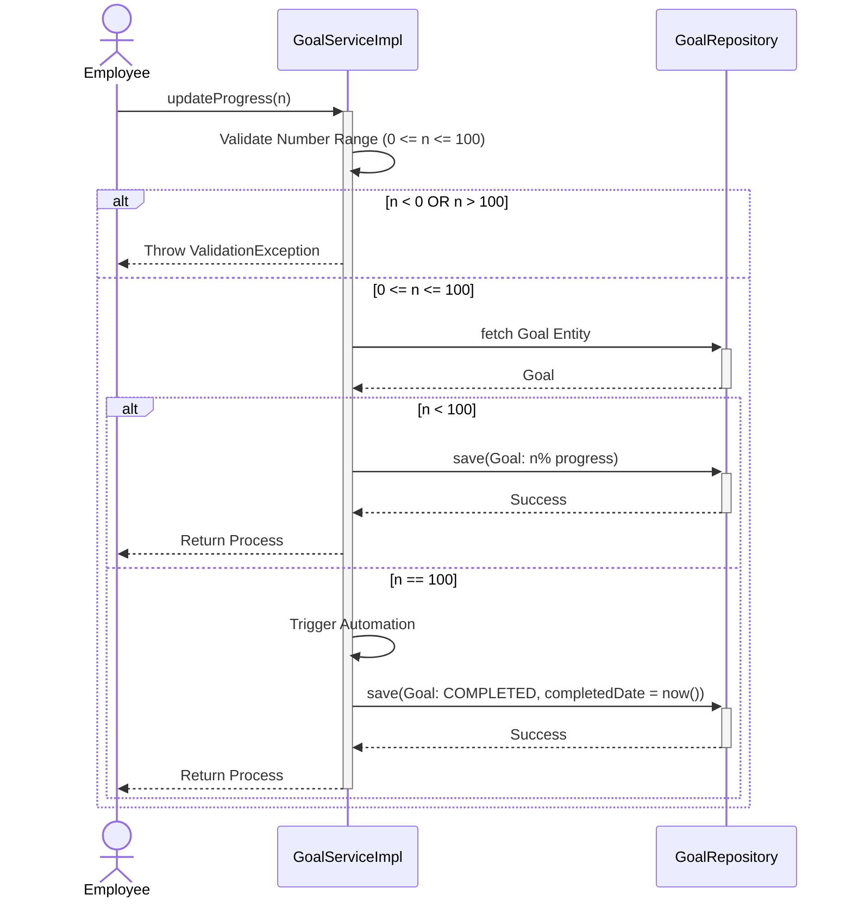
```mermaid
sequenceDiagram
    actor Employee
    participant GoalService as GoalServiceImpl
    participant GoalDAO as GoalRepository
    
    Employee->>+GoalService: updateProgress(n)
    
    GoalService->>GoalService: Validate Number Range (0 <= n <= 100)
    alt n < 0 OR n > 100
        GoalService-->>Employee: Throw ValidationException
    else 0 <= n <= 100
        GoalService->>+GoalDAO: fetch Goal Entity
        GoalDAO-->>-GoalService: Goal
        
        alt n < 100
            GoalService->>+GoalDAO: save(Goal: n% progress)
            GoalDAO-->>-GoalService: Success
            GoalService-->>Employee: Return Process
        else n == 100
            GoalService->>GoalService: Trigger Automation
            GoalService->>+GoalDAO: save(Goal: COMPLETED, completedDate = now())
            GoalDAO-->>-GoalService: Success
            GoalService-->>-Employee: Return Process
        end
    end
```

## 5. Authentication & Login Control Flow

Gating checkpoints protecting the application from brute force and unauthorized entry.

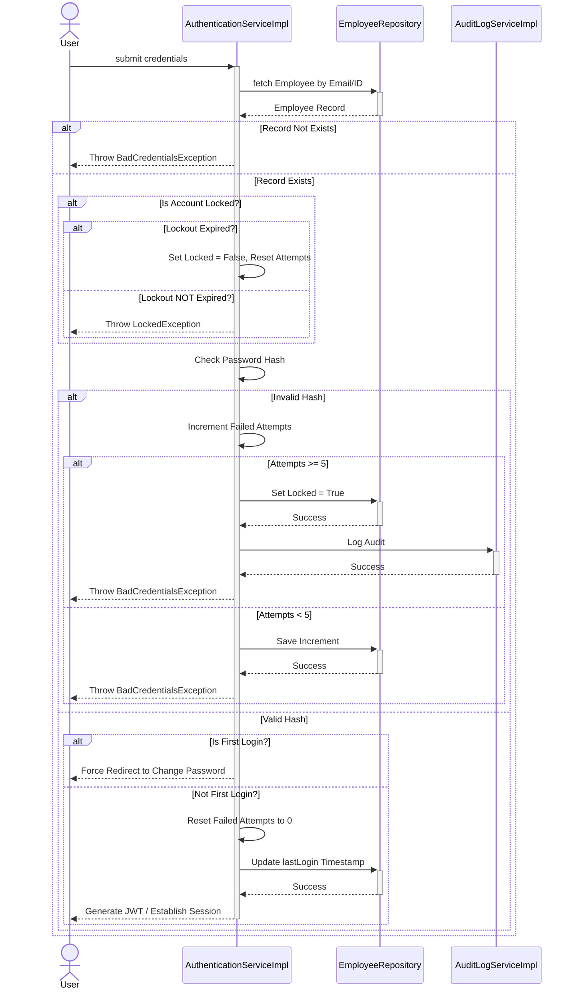
```mermaid
sequenceDiagram
    actor User
    participant AuthService as AuthenticationServiceImpl
    participant EmployeeDAO as EmployeeRepository
    participant AuditService as AuditLogServiceImpl
    
    User->>+AuthService: submit credentials
    AuthService->>+EmployeeDAO: fetch Employee by Email/ID
    EmployeeDAO-->>-AuthService: Employee Record
    
    alt Record Not Exists
        AuthService-->>User: Throw BadCredentialsException
    else Record Exists
        alt Is Account Locked?
            alt Lockout Expired?
                AuthService->>AuthService: Set Locked = False, Reset Attempts
            else Lockout NOT Expired?
                AuthService-->>User: Throw LockedException
            end
        end
        
        AuthService->>AuthService: Check Password Hash
        alt Invalid Hash
            AuthService->>AuthService: Increment Failed Attempts
            alt Attempts >= 5
                AuthService->>+EmployeeDAO: Set Locked = True
                EmployeeDAO-->>-AuthService: Success
                AuthService->>+AuditService: Log Audit
                AuditService-->>-AuthService: Success
                AuthService-->>User: Throw BadCredentialsException
            else Attempts < 5
                AuthService->>+EmployeeDAO: Save Increment
                EmployeeDAO-->>-AuthService: Success
                AuthService-->>User: Throw BadCredentialsException
            end
        else Valid Hash
            alt Is First Login?
                AuthService-->>User: Force Redirect to Change Password
            else Not First Login?
                AuthService->>AuthService: Reset Failed Attempts to 0
                AuthService->>+EmployeeDAO: Update lastLogin Timestamp
                EmployeeDAO-->>-AuthService: Success
                AuthService-->>-User: Generate JWT / Establish Session
            end
        end
    end
```

## 6. Password Recovery Control Flow

Flow mapping a user asserting identity via secondary markers (Security Questions) to restore standard access.

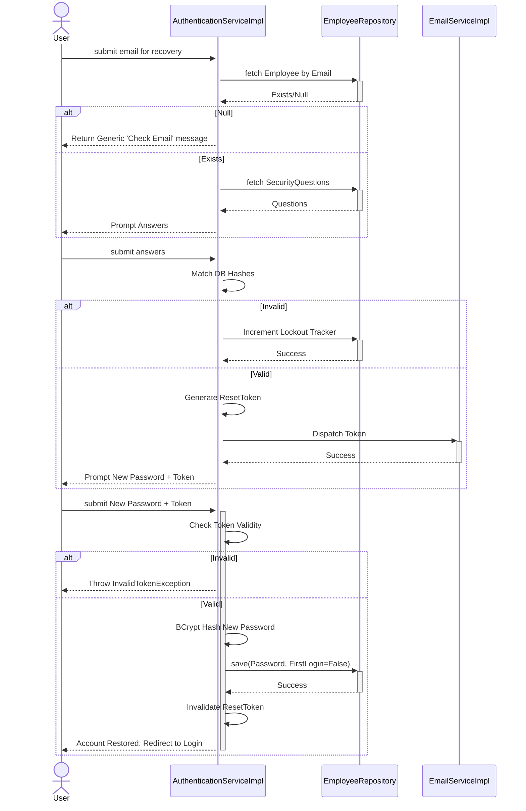
```mermaid
sequenceDiagram
    actor User
    participant AuthService as AuthenticationServiceImpl
    participant EmployeeDAO as EmployeeRepository
    participant EmailService as EmailServiceImpl
    
    User->>+AuthService: submit email for recovery
    AuthService->>+EmployeeDAO: fetch Employee by Email
    EmployeeDAO-->>-AuthService: Exists/Null
    
    alt Null
        AuthService-->>User: Return Generic 'Check Email' message
    else Exists
        AuthService->>+EmployeeDAO: fetch SecurityQuestions
        EmployeeDAO-->>-AuthService: Questions
        AuthService-->>User: Prompt Answers
    end
    
    User->>+AuthService: submit answers
    AuthService->>AuthService: Match DB Hashes
    
    alt Invalid
        AuthService->>+EmployeeDAO: Increment Lockout Tracker
        EmployeeDAO-->>-AuthService: Success
    else Valid
        AuthService->>AuthService: Generate ResetToken
        AuthService->>+EmailService: Dispatch Token
        EmailService-->>-AuthService: Success
        AuthService-->>User: Prompt New Password + Token
    end
    
    User->>+AuthService: submit New Password + Token
    AuthService->>AuthService: Check Token Validity
    
    alt Invalid
        AuthService-->>User: Throw InvalidTokenException
    else Valid
        AuthService->>AuthService: BCrypt Hash New Password
        AuthService->>+EmployeeDAO: save(Password, FirstLogin=False)
        EmployeeDAO-->>-AuthService: Success
        AuthService->>AuthService: Invalidate ResetToken
        AuthService-->>-User: Account Restored. Redirect to Login
    end
```

## 7. Audit Logging System Flow

Invisible background flow: Every save, update, and delete within critical modules intercepts here asynchronously.

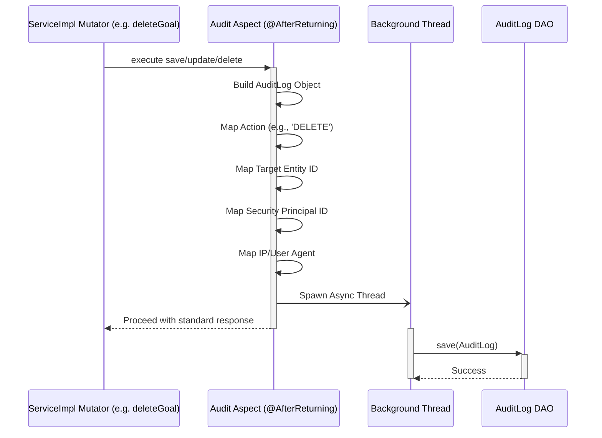
```mermaid
sequenceDiagram
    participant ServiceLayer as ServiceImpl Mutator (e.g. deleteGoal)
    participant AuditAspect as Audit Aspect (@AfterReturning)
    participant AsyncThread as Background Thread
    participant AuditDAO as AuditLog DAO

    ServiceLayer->>+AuditAspect: execute save/update/delete
    AuditAspect->>AuditAspect: Build AuditLog Object
    AuditAspect->>AuditAspect: Map Action (e.g., 'DELETE')
    AuditAspect->>AuditAspect: Map Target Entity ID
    AuditAspect->>AuditAspect: Map Security Principal ID
    AuditAspect->>AuditAspect: Map IP/User Agent
    
    AuditAspect-)AsyncThread: Spawn Async Thread
    AuditAspect-->>-ServiceLayer: Proceed with standard response
    
    activate AsyncThread
    AsyncThread->>+AuditDAO: save(AuditLog)
    AuditDAO-->>-AsyncThread: Success
    deactivate AsyncThread
```

## 8. Employee Onboarding Flow (Admin Action)

Visualizes how the system builds out a new employee tree when the Administrator initializes one.

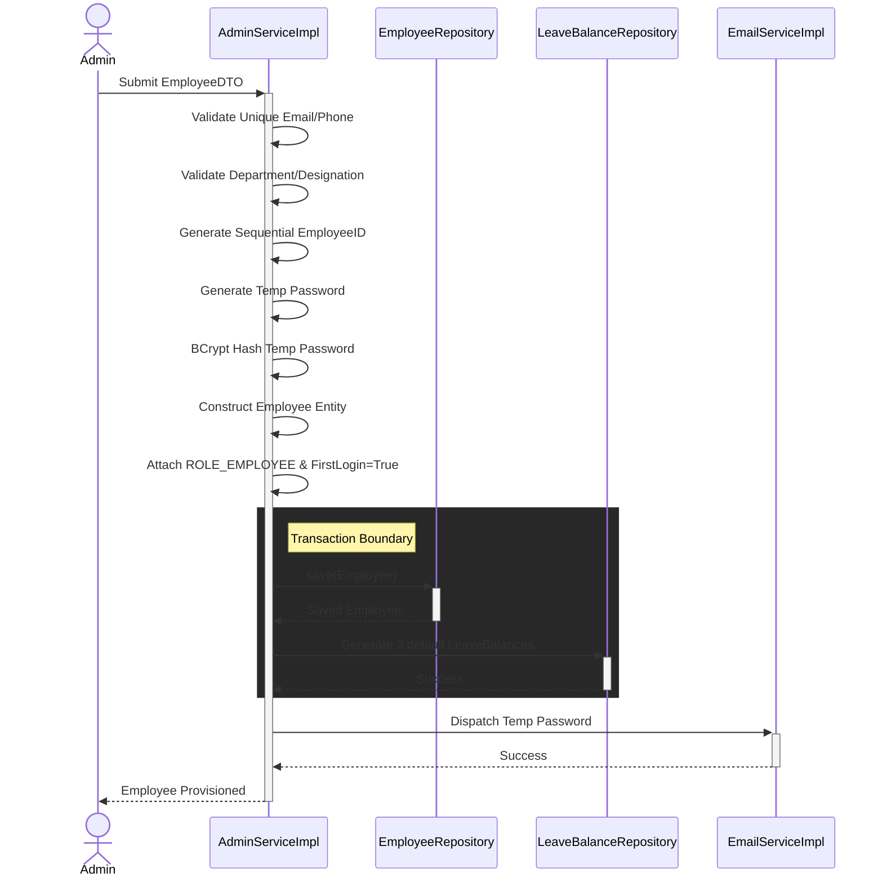
```mermaid
sequenceDiagram
    actor Admin
    participant AdminService as AdminServiceImpl
    participant EmployeeDAO as EmployeeRepository
    participant LeaveBalanceDAO as LeaveBalanceRepository
    participant EmailService as EmailServiceImpl

    Admin->>+AdminService: Submit EmployeeDTO
    AdminService->>AdminService: Validate Unique Email/Phone
    AdminService->>AdminService: Validate Department/Designation
    AdminService->>AdminService: Generate Sequential EmployeeID
    AdminService->>AdminService: Generate Temp Password
    AdminService->>AdminService: BCrypt Hash Temp Password
    AdminService->>AdminService: Construct Employee Entity
    AdminService->>AdminService: Attach ROLE_EMPLOYEE & FirstLogin=True
    
    rect rgb(40, 40, 40)
    note right of AdminService: Transaction Boundary
    AdminService->>+EmployeeDAO: save(Employee)
    EmployeeDAO-->>-AdminService: Saved Employee
    AdminService->>+LeaveBalanceDAO: Generate 3 default LeaveBalances
    LeaveBalanceDAO-->>-AdminService: Success
    end
    
    AdminService->>+EmailService: Dispatch Temp Password
    EmailService-->>-AdminService: Success
    AdminService-->>-Admin: Employee Provisioned
```

## 9. Manager: Revoke Approved Leave Flow

Tracking exceptional circumstances where an already approved timeline must be forcefully disrupted by Leadership.

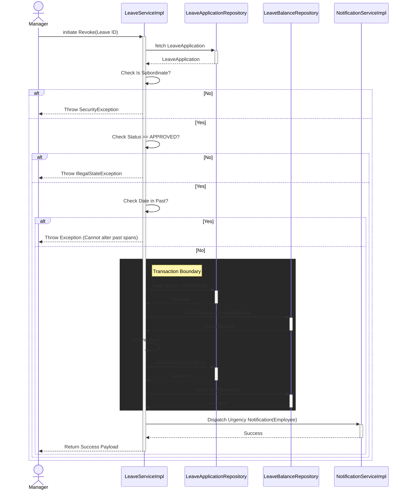
```mermaid
sequenceDiagram
    actor Manager
    participant LeaveService as LeaveServiceImpl
    participant LeaveDAO as LeaveApplicationRepository
    participant LeaveBalanceDAO as LeaveBalanceRepository
    participant NotificationService as NotificationServiceImpl

    Manager->>+LeaveService: initiate Revoke(Leave ID)
    LeaveService->>+LeaveDAO: fetch LeaveApplication
    LeaveDAO-->>-LeaveService: LeaveApplication
    
    LeaveService->>LeaveService: Check Is Subordinate?
    alt No
        LeaveService-->>Manager: Throw SecurityException
    else Yes
        LeaveService->>LeaveService: Check Status == APPROVED?
        alt No
            LeaveService-->>Manager: Throw IllegalStateException
        else Yes
            LeaveService->>LeaveService: Check Date in Past?
            alt Yes
                LeaveService-->>Manager: Throw Exception (Cannot alter past spans)
            else No
                rect rgb(40, 40, 40)
                note right of LeaveService: Transaction Boundary
                LeaveService->>+LeaveDAO: map Status = REVOKED
                LeaveDAO-->>-LeaveService: Success
                LeaveService->>+LeaveBalanceDAO: fetch Employee LeaveBalance
                LeaveBalanceDAO-->>-LeaveService: LeaveBalance
                LeaveService->>LeaveService: Refund Days
                LeaveService->>+LeaveDAO: save(LeaveApplication)
                LeaveDAO-->>-LeaveService: Success
                LeaveService->>+LeaveBalanceDAO: save(LeaveBalance)
                LeaveBalanceDAO-->>-LeaveService: Success
                end
                
                LeaveService->>+NotificationService: Dispatch Urgency Notification(Employee)
                NotificationService-->>-LeaveService: Success
                LeaveService-->>-Manager: Return Success Payload
            end
        end
    end
```

## 10. Administrator: Global Profile/Configuration Update Flow

System-level updates (Data synchronization, Holiday manipulation) execute cautiously differently from user-space logic.

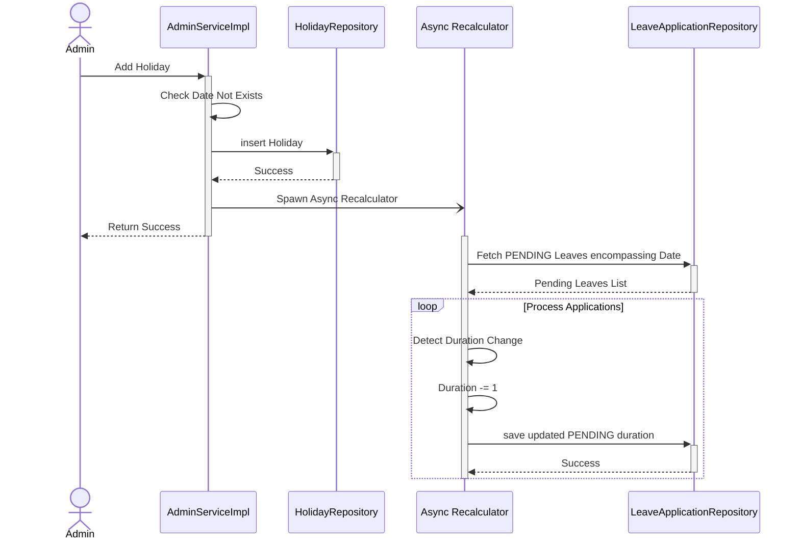
```mermaid
sequenceDiagram
    actor Admin
    participant AdminService as AdminServiceImpl
    participant ConfigDAO as HolidayRepository
    participant AsyncThread as Async Recalculator
    participant LeaveDAO as LeaveApplicationRepository

    Admin->>+AdminService: Add Holiday
    AdminService->>AdminService: Check Date Not Exists
    AdminService->>+ConfigDAO: insert Holiday
    ConfigDAO-->>-AdminService: Success
    
    AdminService-)AsyncThread: Spawn Async Recalculator
    AdminService-->>-Admin: Return Success
    
    activate AsyncThread
    AsyncThread->>+LeaveDAO: Fetch PENDING Leaves encompassing Date
    LeaveDAO-->>-AsyncThread: Pending Leaves List
    
    loop Process Applications
        AsyncThread->>AsyncThread: Detect Duration Change
        AsyncThread->>AsyncThread: Duration -= 1
        AsyncThread->>+LeaveDAO: save updated PENDING duration
        LeaveDAO-->>-AsyncThread: Success
    end
    deactivate AsyncThread
```

## 11. Profile Update Flow

Mapping how non-critical employee profile information is sanitized and attached, avoiding modifications to restricted properties like roles or locked states.

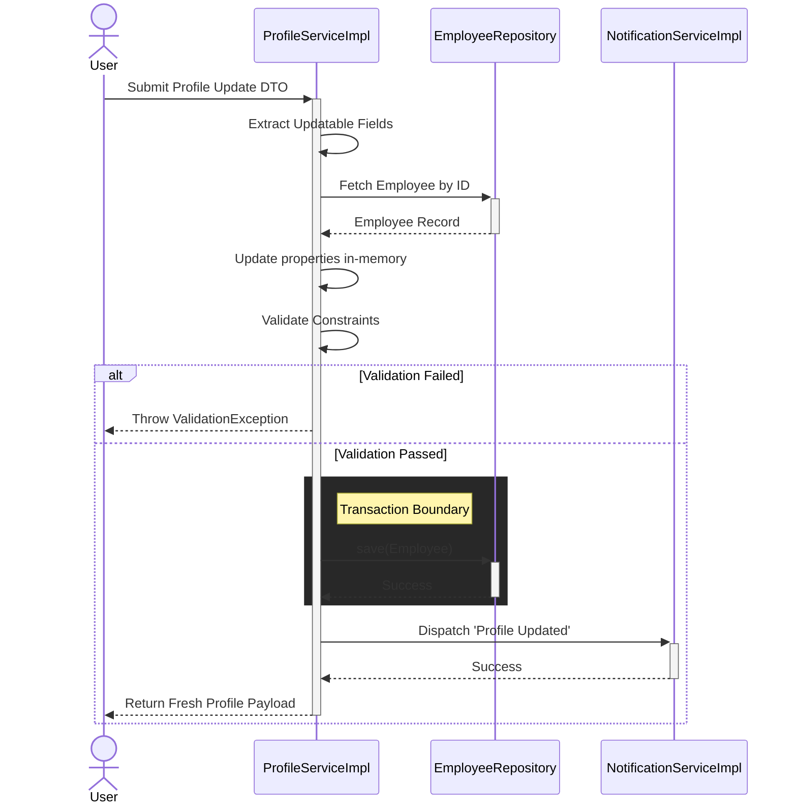
```mermaid
sequenceDiagram
    actor User
    participant ProfileService as ProfileServiceImpl
    participant EmployeeDAO as EmployeeRepository
    participant NotificationService as NotificationServiceImpl

    User->>+ProfileService: Submit Profile Update DTO
    ProfileService->>ProfileService: Extract Updatable Fields
    ProfileService->>+EmployeeDAO: Fetch Employee by ID
    EmployeeDAO-->>-ProfileService: Employee Record
    
    ProfileService->>ProfileService: Update properties in-memory
    ProfileService->>ProfileService: Validate Constraints
    
    alt Validation Failed
        ProfileService-->>User: Throw ValidationException
    else Validation Passed
        rect rgb(40, 40, 40)
        note right of ProfileService: Transaction Boundary
        ProfileService->>+EmployeeDAO: save(Employee)
        EmployeeDAO-->>-ProfileService: Success
        end
        
        ProfileService->>+NotificationService: Dispatch 'Profile Updated'
        NotificationService-->>-ProfileService: Success
        ProfileService-->>-User: Return Fresh Profile Payload
    end
```

## 12. Admin: Leave Quota Assignment/Generation Flow

At the beginning of a fiscal reporting year, Admins trigger logic to generate new blank arrays of `LeaveBalance` properties for all active employees.

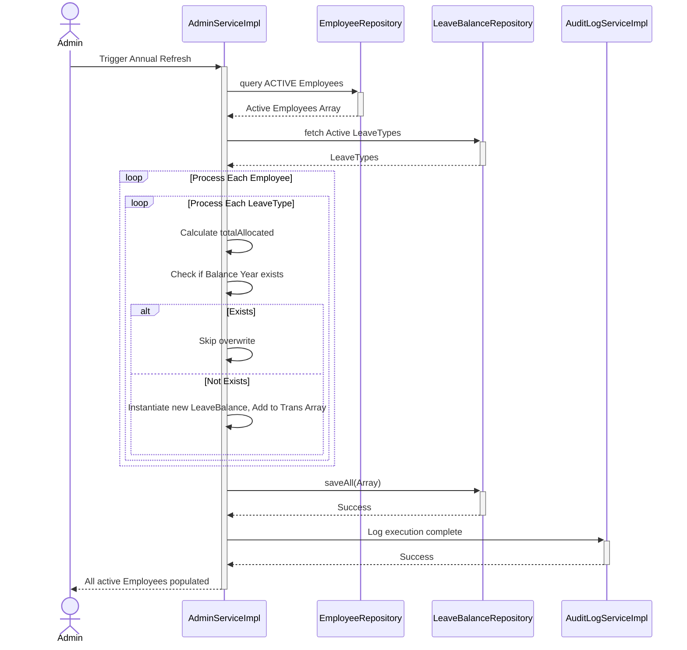
```mermaid
sequenceDiagram
    actor Admin
    participant QuotaService as AdminServiceImpl
    participant EmployeeDAO as EmployeeRepository
    participant LeaveBalanceDAO as LeaveBalanceRepository
    participant AuditService as AuditLogServiceImpl

    Admin->>+QuotaService: Trigger Annual Refresh
    QuotaService->>+EmployeeDAO: query ACTIVE Employees
    EmployeeDAO-->>-QuotaService: Active Employees Array
    QuotaService->>+LeaveBalanceDAO: fetch Active LeaveTypes
    LeaveBalanceDAO-->>-QuotaService: LeaveTypes
    
    loop Process Each Employee
        loop Process Each LeaveType
            QuotaService->>QuotaService: Calculate totalAllocated
            QuotaService->>QuotaService: Check if Balance Year exists
            alt Exists
                QuotaService->>QuotaService: Skip overwrite
            else Not Exists
                QuotaService->>QuotaService: Instantiate new LeaveBalance, Add to Trans Array
            end
        end
    end
    
    QuotaService->>+LeaveBalanceDAO: saveAll(Array)
    LeaveBalanceDAO-->>-QuotaService: Success
    QuotaService->>+AuditService: Log execution complete
    AuditService-->>-QuotaService: Success
    QuotaService-->>-Admin: All active Employees populated
```

## 13. Goal Performance Assessment Pipeline

Tracking how iterative `progress` updates trigger calculations against the eventual overall evaluation weight map.

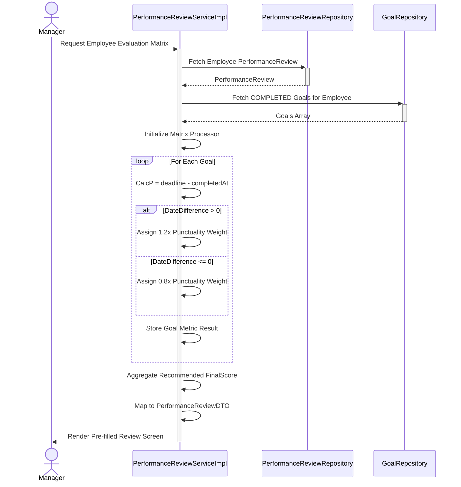
```mermaid
sequenceDiagram
    actor Manager
    participant AssessmentService as PerformanceReviewServiceImpl
    participant PerformanceDAO as PerformanceReviewRepository
    participant GoalDAO as GoalRepository

    Manager->>+AssessmentService: Request Employee Evaluation Matrix
    AssessmentService->>+PerformanceDAO: Fetch Employee PerformanceReview
    PerformanceDAO-->>-AssessmentService: PerformanceReview
    AssessmentService->>+GoalDAO: Fetch COMPLETED Goals for Employee
    GoalDAO-->>-AssessmentService: Goals Array
    
    AssessmentService->>AssessmentService: Initialize Matrix Processor
    
    loop For Each Goal
        AssessmentService->>AssessmentService: CalcP = deadline - completedAt
        alt DateDifference > 0
            AssessmentService->>AssessmentService: Assign 1.2x Punctuality Weight
        else DateDifference <= 0
            AssessmentService->>AssessmentService: Assign 0.8x Punctuality Weight
        end
        AssessmentService->>AssessmentService: Store Goal Metric Result
    end
    
    AssessmentService->>AssessmentService: Aggregate Recommended FinalScore
    AssessmentService->>AssessmentService: Map to PerformanceReviewDTO
    AssessmentService-->>-Manager: Render Pre-filled Review Screen
```

## 14. Global Notification Broadcasting Flow

Charting how the Admin or System Broadcast components effectively loop and spam asynchronous alert events down the tree without blocking primary HTTP request threads.

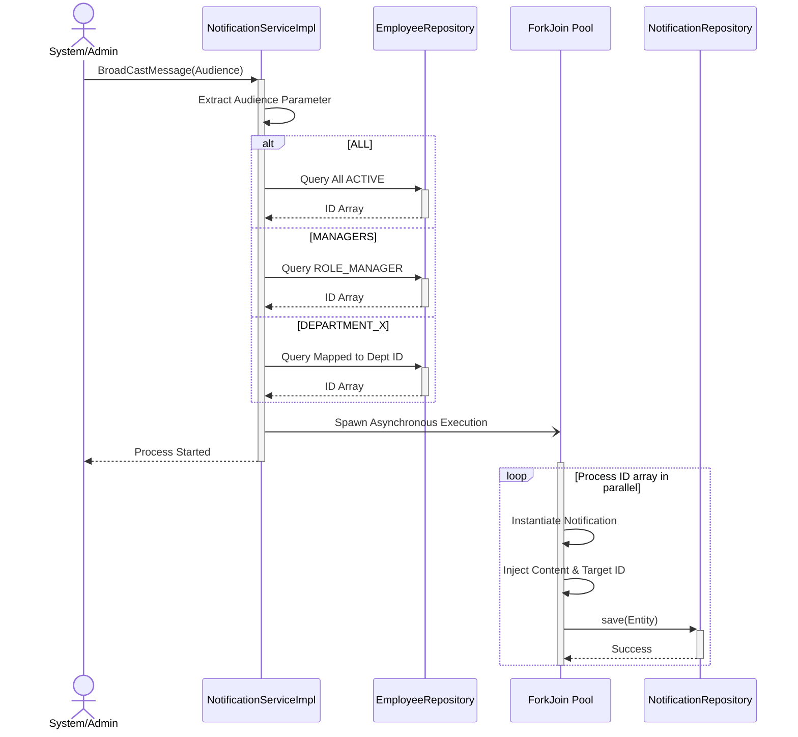
```mermaid
sequenceDiagram
    actor Trigger as System/Admin
    participant BroadcastService as NotificationServiceImpl
    participant EmployeeDAO as EmployeeRepository
    participant AsyncPool as ForkJoin Pool
    participant NotificationDAO as NotificationRepository

    Trigger->>+BroadcastService: BroadCastMessage(Audience)
    BroadcastService->>BroadcastService: Extract Audience Parameter
    
    alt ALL
        BroadcastService->>+EmployeeDAO: Query All ACTIVE
        EmployeeDAO-->>-BroadcastService: ID Array
    else MANAGERS
        BroadcastService->>+EmployeeDAO: Query ROLE_MANAGER
        EmployeeDAO-->>-BroadcastService: ID Array
    else DEPARTMENT_X
        BroadcastService->>+EmployeeDAO: Query Mapped to Dept ID
        EmployeeDAO-->>-BroadcastService: ID Array
    end
    
    BroadcastService-)AsyncPool: Spawn Asynchronous Execution
    BroadcastService-->>-Trigger: Process Started
    
    activate AsyncPool
    loop Process ID array in parallel
        AsyncPool->>AsyncPool: Instantiate Notification
        AsyncPool->>AsyncPool: Inject Content & Target ID
        AsyncPool->>+NotificationDAO: save(Entity)
        NotificationDAO-->>-AsyncPool: Success
    end
    deactivate AsyncPool
```

## 15. Reports Extraction (Export to Presentation Layer)

Tracking the huge computational funnel gathering system states for mapping to DataVisualization components (e.g. pie charts).

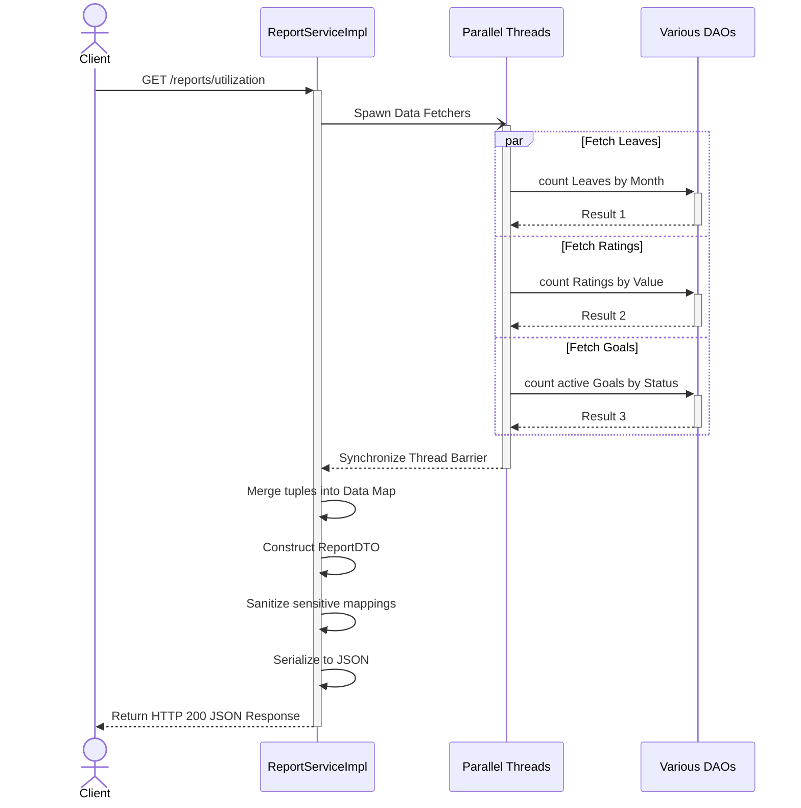
```mermaid
sequenceDiagram
    actor Client
    participant ReportService as ReportServiceImpl
    participant AsyncFetcher as Parallel Threads
    participant DB as Various DAOs

    Client->>+ReportService: GET /reports/utilization
    ReportService-)AsyncFetcher: Spawn Data Fetchers
    
    activate AsyncFetcher
    par Fetch Leaves
        AsyncFetcher->>+DB: count Leaves by Month
        DB-->>-AsyncFetcher: Result 1
    and Fetch Ratings
        AsyncFetcher->>+DB: count Ratings by Value
        DB-->>-AsyncFetcher: Result 2
    and Fetch Goals
        AsyncFetcher->>+DB: count active Goals by Status
        DB-->>-AsyncFetcher: Result 3
    end
    
    AsyncFetcher-->>ReportService: Synchronize Thread Barrier
    deactivate AsyncFetcher
    
    ReportService->>ReportService: Merge tuples into Data Map
    ReportService->>ReportService: Construct ReportDTO
    ReportService->>ReportService: Sanitize sensitive mappings
    ReportService->>ReportService: Serialize to JSON
    ReportService-->>-Client: Return HTTP 200 JSON Response
```
