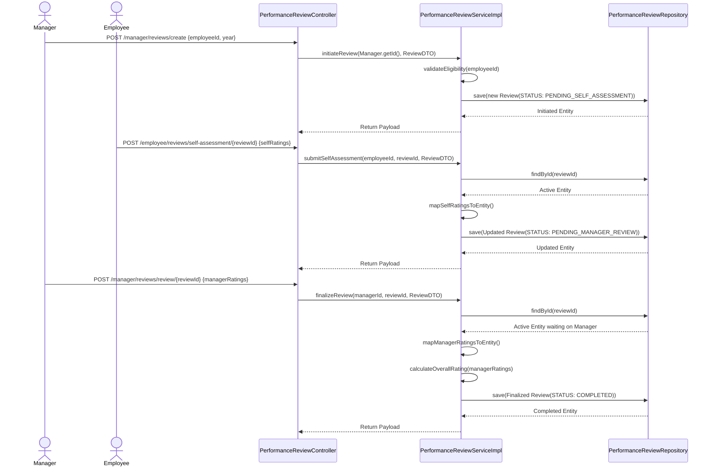
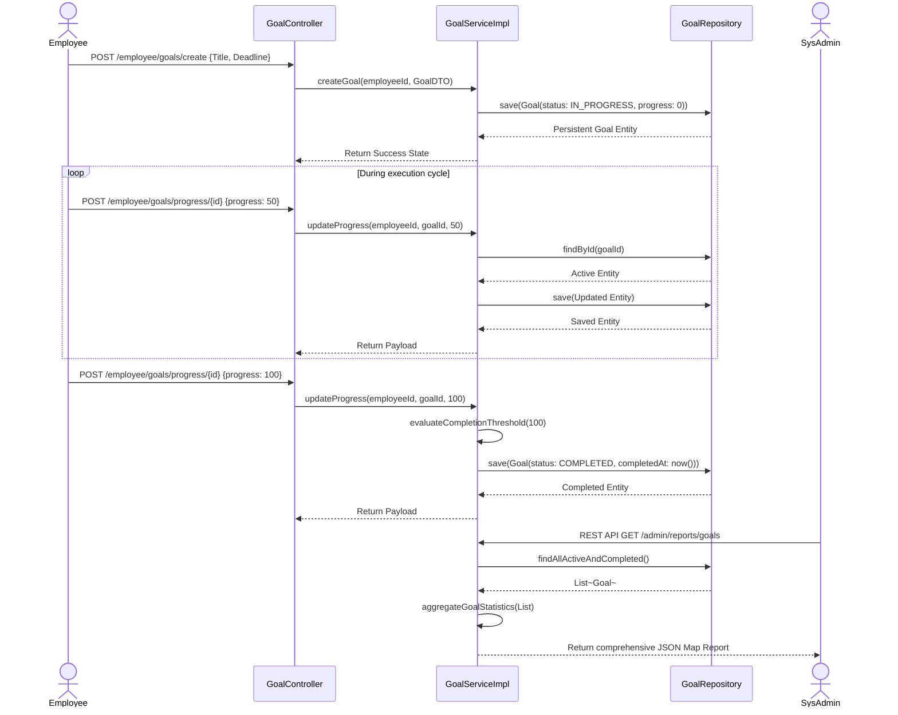

# Comprehensive Sequence Diagrams

This document charts out the detailed interactions between the System Actors (Employees, Managers, Admins), Controllers, Service Implementations, and Repositories. It provides an architectural glimpse into how data is processed within RevWorkForce.

## 1. Leave Management: End-to-End Application and Approval
This sequence tracks the steps from an employee submitting a leave to the manager taking an action on it, and the resulting validations.

```mermaid
sequenceDiagram
    actor Employee
    participant UI as Browser/Thymeleaf
    participant LC as LeaveController
    participant LS as LeaveServiceImpl
    participant NS as NotificationServiceImpl
    participant LR as LeaveRepository
    participant LBR as LeaveBalanceRepository
    actor Manager
    
    %% Employee Form Submission
    Employee->>UI: Submit Leave Form (Dates, Reason, Type)
    UI->>LC: POST /employee/apply HTTP/1.1
    LC->>LS: applyForLeave(employeeEmail, LeaveApplicationDTO)
    
    %% Business Valditions
    LS->>LBR: findByEmployeeAndLeaveType(employee.getId(), type.getId())
    LBR-->>LS: LeaveBalance
    LS->>LS: calculateRequestedDays(startDate, endDate)
    LS->>LS: validateDateOverlaps(employee, dates)
    alt Balance Insufficient
        LS-->>LC: throw LeaveAllocationException("Insufficient Balance")
        LC-->>UI: Return to Form with Error
    else Valid Application
        LS->>LR: save(new LeaveApplication)
        LR-->>LS: Application Persistent Entity
        LS->>NS: triggerNotification(manager, "A new leave requires approval")
        LS-->>LC: Return Success Payload
        LC-->>UI: Redirect to Leave History View
    end
    
    %% Manager Action
    Manager->>UI: Clicks "Approve" on Pending Request Item
    UI->>LC: POST /manager/approve/{id} HTTP/1.1
    LC->>LS: approveLeave(id, managerIdentifier)
    LS->>LR: findById(id)
    LR-->>LS: Pending LeaveApplication
    LS->>LS: verifyManagerAuthority(manager, application.getEmployee())
    LS->>LBR: updateLeaveBalance(employee, daysToDeduct)
    LBR-->>LS: Updated Balance Persistent Entity
    LS->>LR: setStatus(APPROVED); save(LeaveApplication)
    LR-->>LS: Approved Entity
    LS->>NS: triggerNotification(employee, "Leave Approved")
    LS-->>LC: Return Success Payload
    LC-->>UI: Redirect to Manager Dashboard
```

## 2. Performance Reviews: Standard Evaluation Cycle
This workflow tracks a Manager kicking off a review, the employee filling their assessment, and the Manager sealing the final official ratings.



## 3. Goals Tracking: Self-Assignment & Reporting
This sequence tracks an employee creating a goal and progressively updating it until completion.


