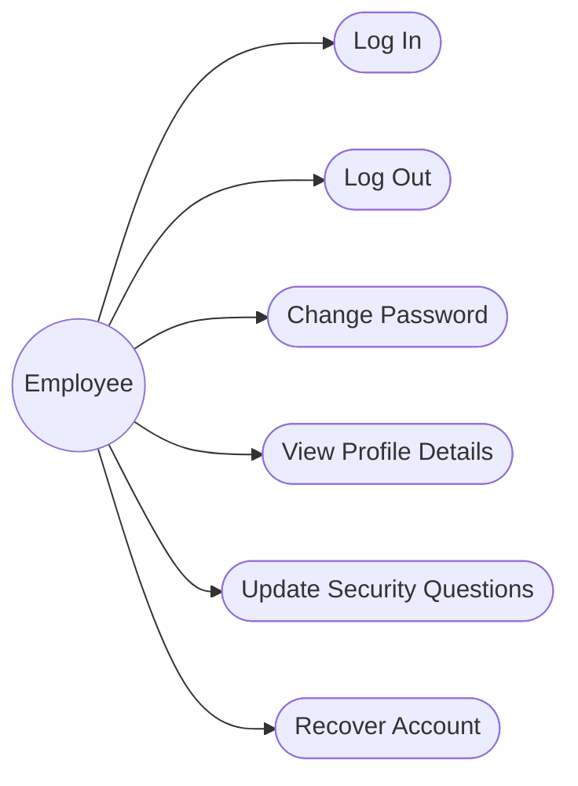
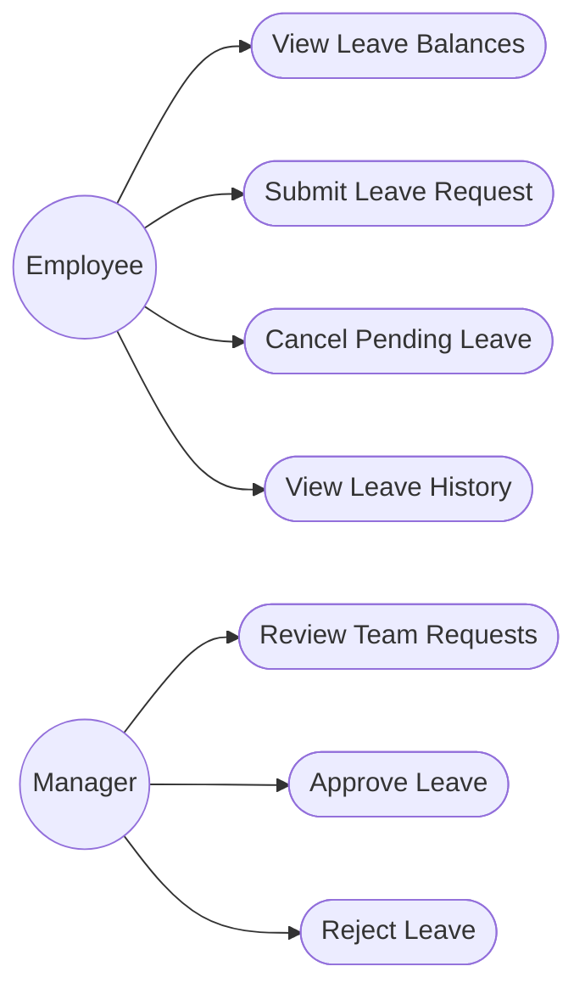
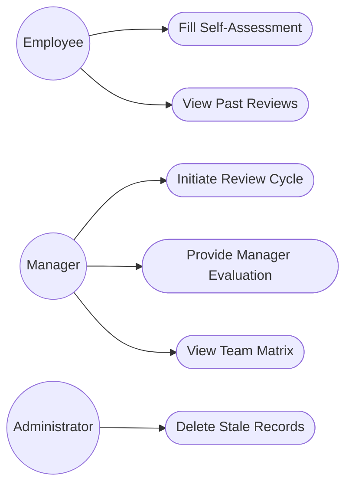
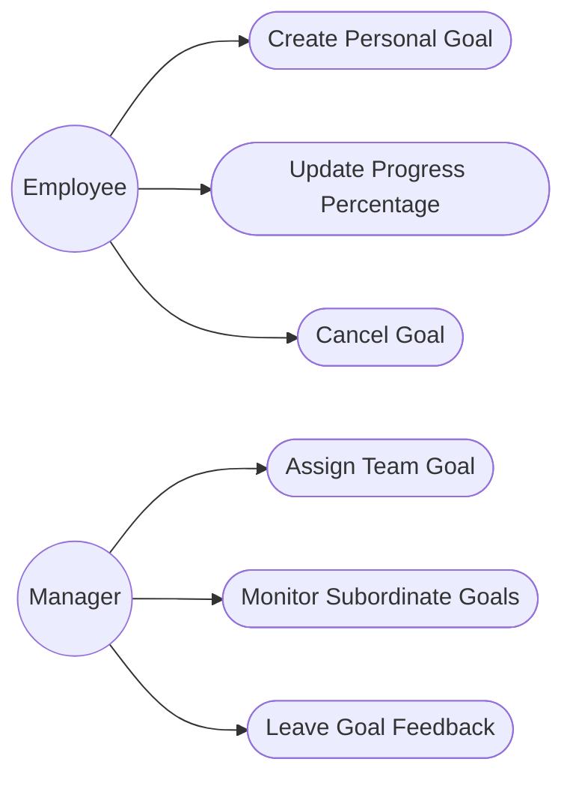
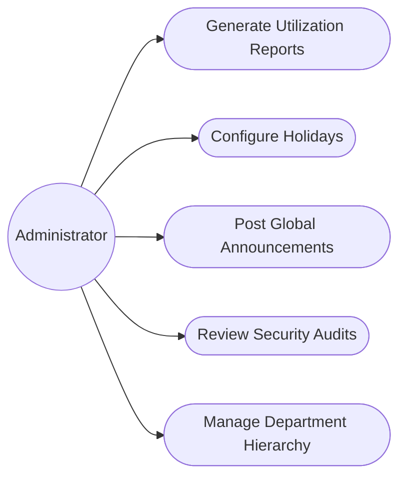

# Comprehensive Use Case Diagrams and Specifications

This document illustrates the precise mapping of features (use cases) against the specific user roles within the RevWorkForce platform. It breaks down the system into core functional modules for better readability.

## 1. Authentication and Profile Management

### Specifications
- **Log In**: Validates credentials against the database. Automatically locks account after 5 failed attempts.
- **Recover Account**: Triggered when a user forgets their password. Leverages Security Questions.

---

## 2. Leave Management Module

### Specifications
- **Submit Leave Request**: The system calculates the actual duration excluding configured company holidays. Fails if duration exceeds `LeaveBalance`.
- **Review Team Requests**: Managers see overlapping team leaves to gauge department impact before approving.

---

## 3. Performance Review Module

### Specifications
- **Initiate Review Cycle**: Generates a new `PerformanceReview` skeleton and alerts the Employee.
- **Fill Self-Assessment**: Employee fills in subjective achievements and soft-skills ratings.
- **Provide Manager Evaluation**: Manager inputs final overarching ratings which lock the review as `COMPLETED`.

---

## 4. Goals Tracking Module

### Specifications
- **Update Progress**: Employees shift the integer value from 0 to 100.
- **Assign Team Goal**: Managers can forcefully drop a goal onto an employee's dashboard with a strict deadline.

---

## 5. Administration and Internal Operations

### Specifications
- **Generate Utilization Reports**: Aggregates massive data sets across all other modules into JSON summaries suitable for rendering DataTables and Charts.
- **Review Security Audits**: Admins monitor the `AuditLog` table which tracks every mutation (UPDATE/DELETE/INSERT) committed by any user.
